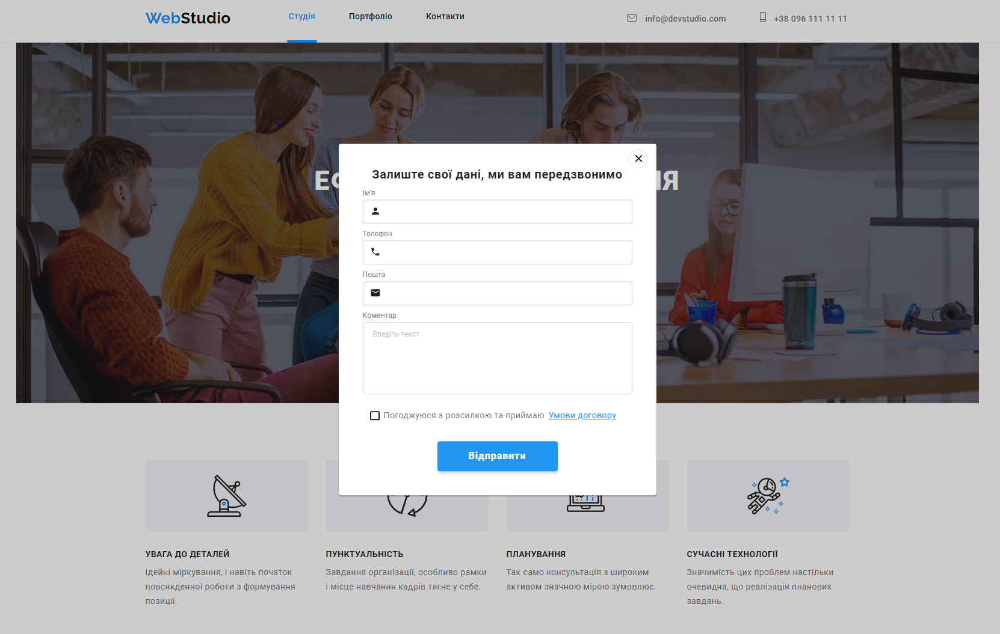
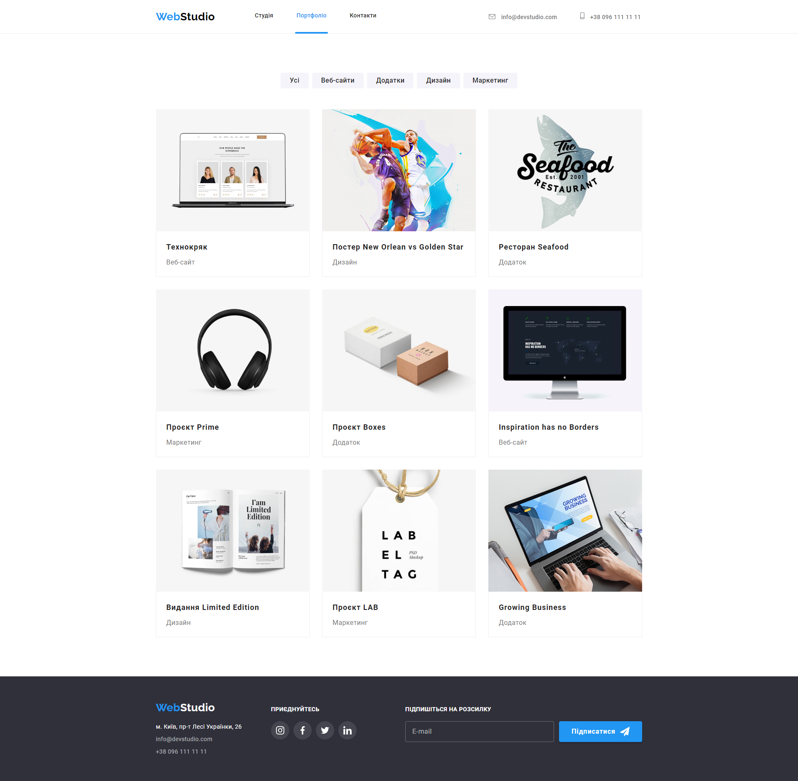

# WebStudio website

## Homework#06

Added markup and design of forms for
[Layout markup](<https://www.figma.com/file/1ehrLBauvVFu4mVhxsHzyZ/Web-Studio-(Version-2.1)?node-id=1%3A4613>).
Configured GitHub Pages and added a [link](https://valerii2022.github.io/goit-markup-hw-06-FSON/) to
the live page in the GitHub-repository header.

### [Main Page](https://valerii2022.github.io/goit-markup-hw-06-FSON/)

 

### [Portfolio Page](https://valerii2022.github.io/goit-markup-hw-06-FSON/portfolio.html)

